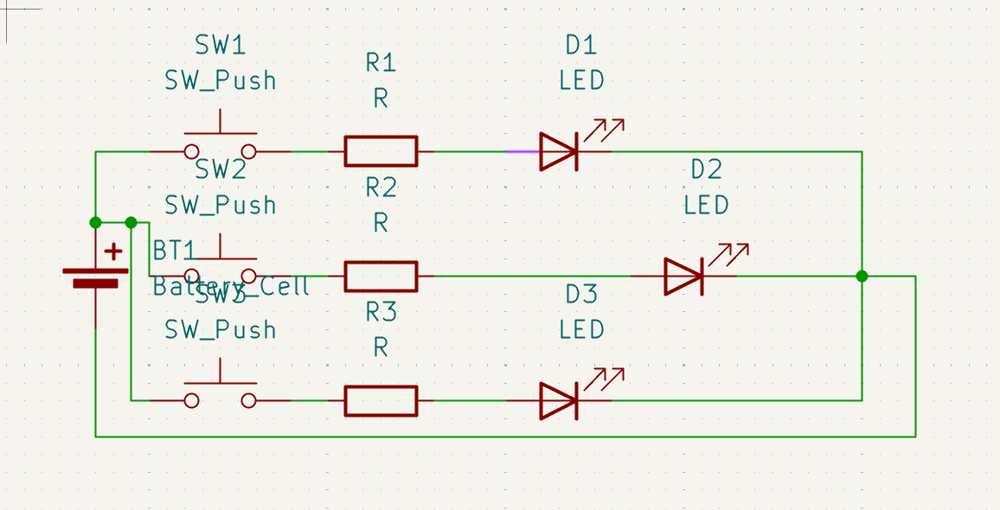
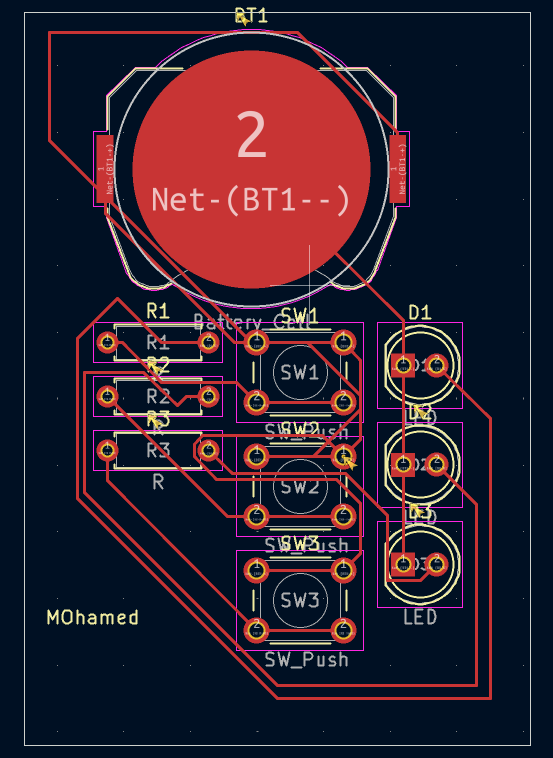
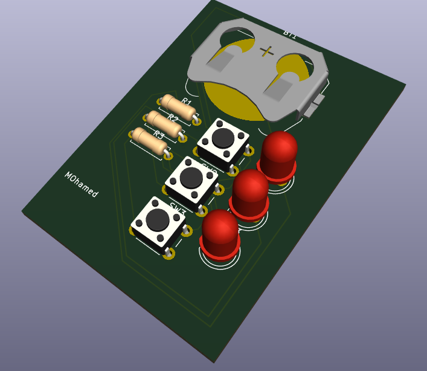

# LED Pushbutton Circuit with KiCad

## 📘 Description
A simple KiCad project that includes a battery-powered LED circuit with three push buttons. Each button lights a separate LED when pressed.

## Bill of Materials (BOM)

| Component        | Quantity | Notes                        |
|------------------|----------|------------------------------|
| Resistor (R)     | 3        | 220Ω recommended             |
| LED              | 3        | Red/Green/Blue               |
| Push Button      | 3        | THT push button              |
| Battery Holder   | 1        | 9V or coin cell holder       |
| Battery          | 1        | 9V or CR2032                 |
| PCB              | 1        | Custom made using KiCad      |

## 🖼️ Screenshots

### Schematic  

### PCB Layout  

### 3D View  

## 💬 Slack Username
`@Mohamed Assem`

---

## 🛠️ Files Included
- KiCad project files (`.kicad_sch`, `.kicad_pcb`, etc.)
- Gerber files (in `/gerbers` folder)
- Drill files
- Screenshots
